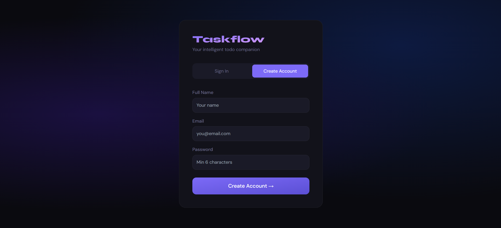
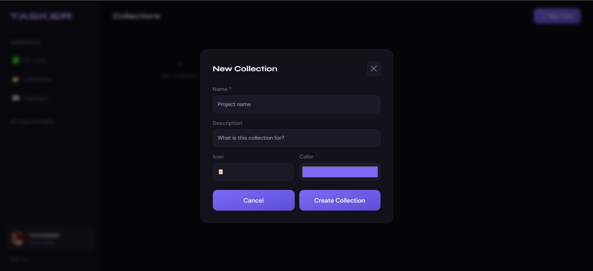
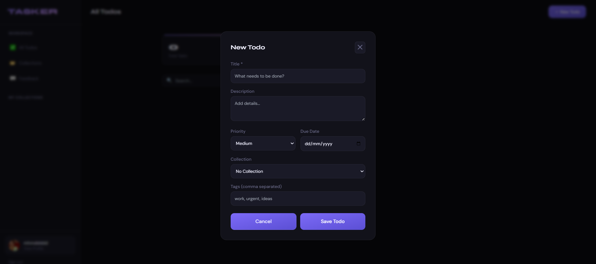
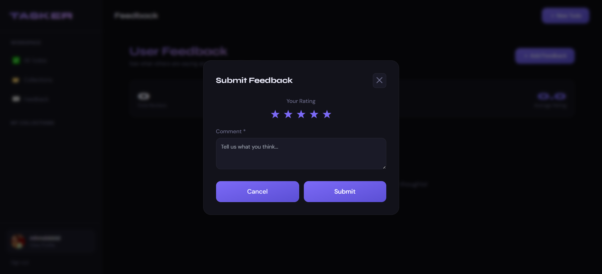
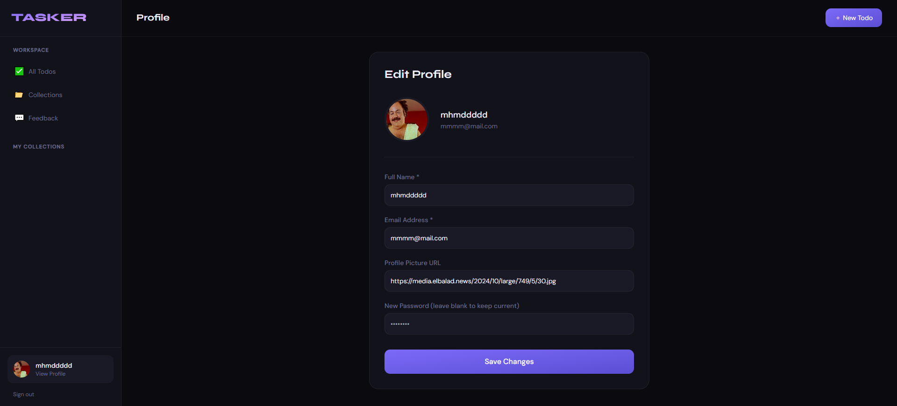

# 📝 TASKER App

A robust, modern, and beautiful fullstack task management application. This project allows users to track their tasks, categorize them into collections, and even leave public feedback/evaluations about the application!

## ✨ Features

- **User Authentication**: Secure Login & Registration with JWT.
- **Task Management**: Create, Read, Update, and Delete your daily todos.
- **Collections**: Group your tasks into customizable collections (e.g., Work, Personal) with unique colors and icons.
- **Advanced Filtering**: Sort and filter tasks by priority, status (completed/pending), and due dates.
- **User Feedback System**: Allow users to submit and view public 5-star ratings and feedback about the app.
- **User Profiles**: Manage your account, upload avatars, and track your stats.
- **Premium UI/UX**: Sleek, responsive, and dynamic interface built with modern web design principles (Tailwind CSS).

---

## 📖 Usage Guidelines

1. **Sign Up**: Start by creating a new account on the `/register` page.

2. **Create Collections**: Before adding complex tasks, create a collection (e.g., "Development") to organize your workflow.

3. **Add Tasks**: Click the "New Todo" button to create tasks. You can assign them priorities, due dates, and link them to your collections.

4. **Submit Feedback**: Navigate to the Feedback section in the sidebar to let other users know what you think about the platform!

5. **Edit profile**: Upload a photo for your profile and edit your information


## 🛠️ Tech Stack

**Frontend:**
- React (Vite)
- Tailwind CSS (Styling)
- Formik & Yup (Form handling and validation)
- React Router (Navigation)

**Backend:**
- Node.js & Express
- NeDB (Lightweight local database, similar to MongoDB)
- JSON Web Tokens (JWT)
- bcrypt (Password Hashing)

---


## 📂 Project Structure

```text
Fullstack-todo/
├── index.js                  # Main Express Server entry point
├── controllers/              # Backend route logic (Todos, Users, Collections, Feedback)
├── routes/                   # API endpoint definitions
├── models/                   # NeDB database configurations (db.js)
├── middleware/               # Auth middleware
├── data/                     # Local NeDB data storage (.db files)
└── frontend/                 # React Frontend application
    ├── src/
    │   ├── components/       # Reusable UI components
    │   ├── context/          # React Context (Auth context)
    │   ├── layouts/          # Main application layout & Sidebar
    │   ├── pages/            # Page components (Todos, Login, Feedback, etc.)
    │   └── services/         # API abstraction
    └── vite.config.js        # Vite configuration (includes API proxy)
```

---

##  For Developers

- **Database**: This app uses `NeDB`, which stores data locally in the `/data` folder using `.db` files. You don't need to configure MongoDB or external databases. If you ever want to clear the database, simply delete the `.db` files inside the `data/` folder and restart the server.
- **API Proxy**: The frontend uses Vite's proxy to forward `/api` requests to `http://localhost:3000` to prevent CORS issues during development. Ensure the backend is running on port 3000.


## 🚀 Getting Started

### Prerequisites

Make sure you have [Node.js](https://nodejs.org/) (v16 or higher) installed on your system.

### 1. Installation

First, clone the repository and navigate into the project directory:

```bash
# Install backend dependencies
npm install

# Navigate to the frontend directory
cd frontend

# Install frontend dependencies
npm install
```

### 2. Running the Application

To run this application locally, you will need to start both the backend server and the frontend development server.

**Start the Backend Server:**
Open a terminal in the root directory (`Fullstack-todo/`) and run:
```bash
node index.js
```
*The API will start running on `http://localhost:3000`.*

**Start the Frontend Server:**
Open a second terminal, navigate to the `frontend/` directory, and run:
```bash
npm run dev
```
*The frontend will start running on `http://localhost:5173`.*

---
